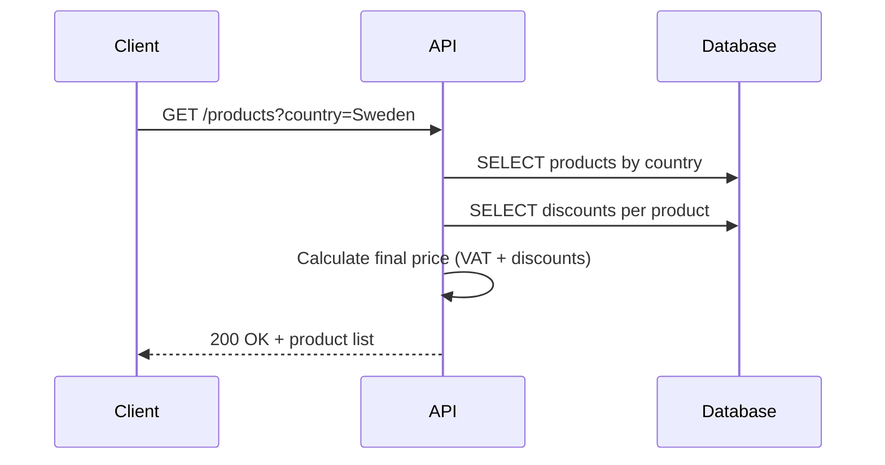
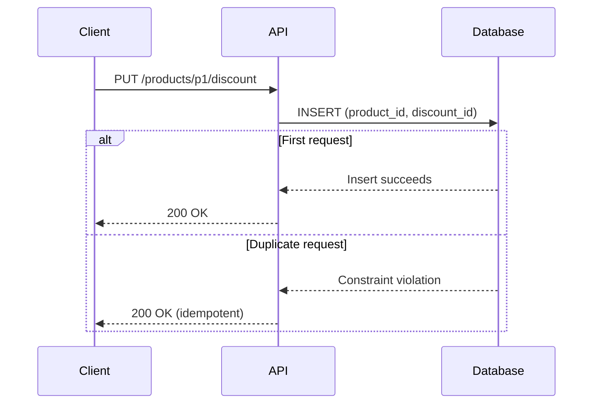

---

## 2️⃣ ARCHITECTURE.md (Required)

Create `ARCHITECTURE.md`.

### ✅ **ARCHITECTURE.md (copy-paste)**

```markdown
# Architecture & Design

## Overview

The system is a Kotlin (Ktor) REST API backed by PostgreSQL.  
It manages products, applies discounts, and calculates final prices including VAT.

Key goals:
- Correct price calculation
- Idempotent discount application
- Strong concurrency guarantees

---

## High-Level Design

- **Ktor** handles HTTP routing
- **Exposed ORM** manages database access
- **PostgreSQL** enforces concurrency and uniqueness
- **Service layer** encapsulates business logic
- **Database-level constraints** ensure idempotency

---

## Data Model

### Products
- `id` (PK)
- `name`
- `base_price`
- `country`

### Product Discounts
- `product_id`
- `discount_id`
- `percent`

Composite primary key:
(product_id, discount_id)


This guarantees that the same discount cannot be applied more than once to the same product.

---

## Concurrency & Idempotency Strategy

### Problem
Multiple clients may attempt to apply the same discount concurrently.

### Solution
- No in-memory locks
- No synchronized blocks
- Rely exclusively on the database

### Why it works
- The `(product_id, discount_id)` composite primary key prevents duplicates
- Concurrent inserts race, but only one succeeds
- All subsequent identical requests are effectively no-ops

This approach is:
- Safe under heavy load
- Horizontally scalable
- Stateless at the application level

---

## Sequence Diagrams

### GET /products




### PUT /products/{id}/discount




### Testing Strategy

- Uses testApplication {} from Ktor

- Sends concurrent HTTP requests using coroutines

Verifies:

- No crashes

- Correct HTTP responses

- Idempotent behavior under concurrency
